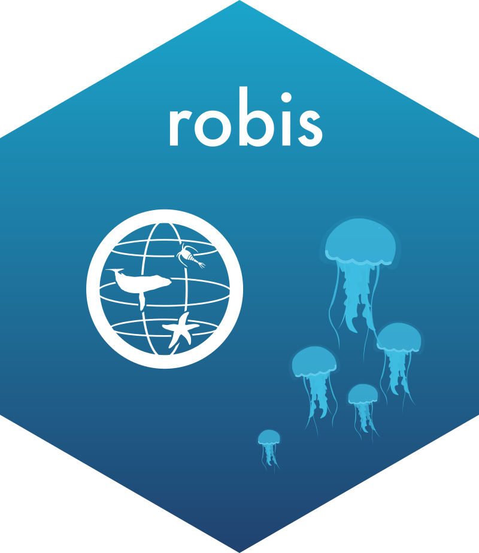




OBIS created some packages and pipelines to help users work with OBIS data within a programming environment. Our main packages were developed for the __R__ language.

Chose your programming language:

- [R](#r)
- [Python](#python)
- [Julia](#julia)

------

### R




##### robis

`robis`, our flagship R package, is a client for the OBIS API. It includes functions for data access, as well as a few helper functions for visualizing occurrence data and extracting nested MeasurementOrFact or DNADerivedData records.
 
Available through CRAN (use `install.packages("robis")`)  
GitHub: https://github.com/iobis/robis




##### `obistools`

##### `obisdi`

-------

### Python

-------

### Julia