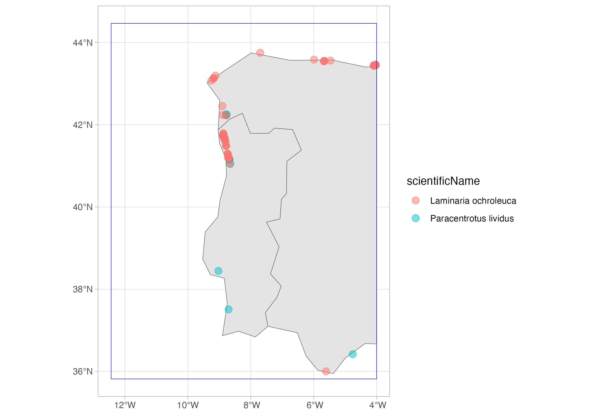
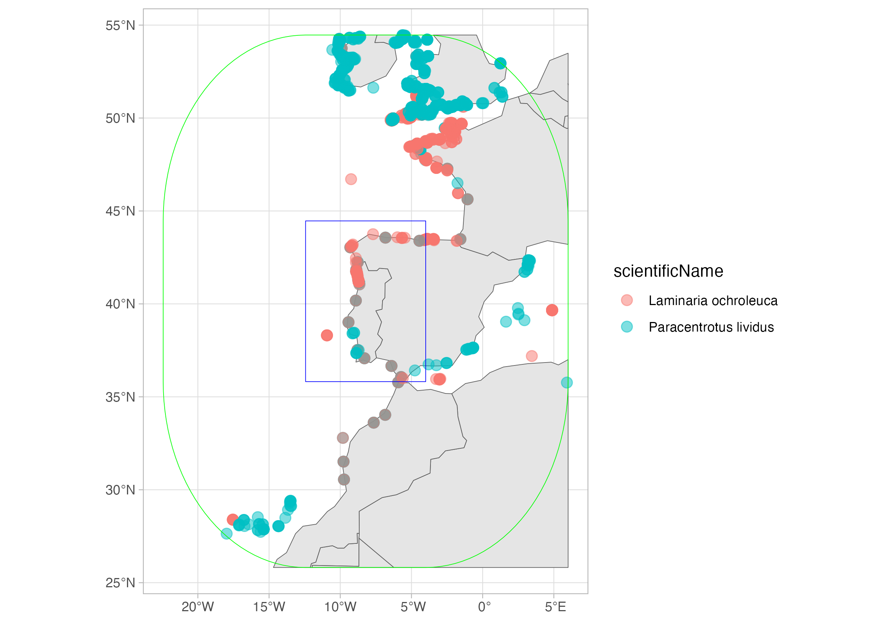
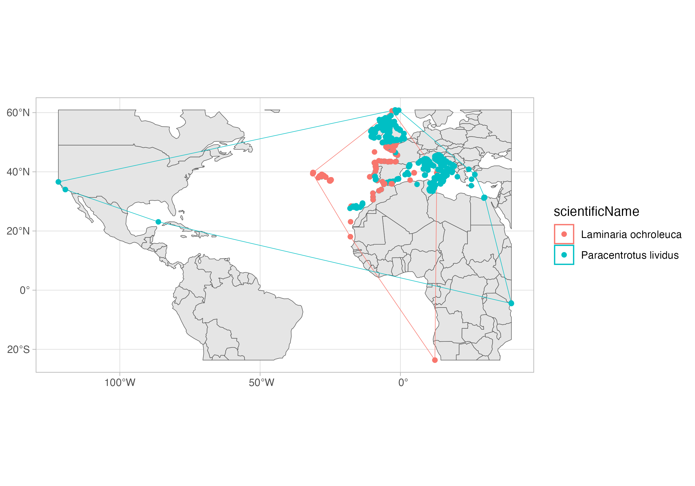

# Spatial extension of DuckDB

In a [previous tutorial]() we learned about **DuckDB** and how it can be used to query Parquet datasets from OBIS. As we shared, the new full export is a [GeoParquet](https://geoparquet.org/) dataset, meaning that it add spatial functionalities to the standard Parquet format. DuckDB has a powerful spatial extension, which we will present in this tutorial. Of course, we will just give you a glimpse of what you can do with this extension, and you should invest a few minutes to explore the [full documentation](https://duckdb.org/docs/stable/core_extensions/spatial/overview.html).

Again, we will work with a local copy of the full export, which you can download from here: https://obis.org/data/access/. You can also explore together through the Jupyter Notebook ([download it locally](https://github.com/iobis/resources/blob/main/content/tutorials/duckdb-part2/duckdb-part2.ipynb) or open it through **Google Colab** by [clicking here](https://colab.research.google.com/github/iobis/resources/blob/main/content/tutorials/duckdb-part2/duckdb-part2.ipynb)).

We will get all records for the sea-urchin [*Paracentrotus lividus*](https://obis.org/taxon/124316) and the macroalgae [*Laminaria ochroleuca*](https://obis.org/taxon/145728) on a region in the coast of Portugal and Spain. We will use a WKT (Well-Known Text) representation of a polygon:

`POLYGON ((-12.436523 35.817813, -3.999023 35.817813, -3.999023 44.465151, -12.436523 44.465151, -12.436523 35.817813))`

You can check it on this nice website: https://wktmap.com/

``` r
suppressPackageStartupMessages(library(dplyr)) # For some analysis
suppressPackageStartupMessages(library(duckdb)) # Our main package
suppressPackageStartupMessages(library(tictoc)) # To get timings
suppressPackageStartupMessages(library(glue)) # To easily make the queries text
suppressPackageStartupMessages(library(sf)) # To later work with the spatial results
suppressPackageStartupMessages(library(ggplot2)) # For plotting

# To work with DuckDB, we need to start by oppening a
# connection to an in-memory database, using the DBI package
con <- dbConnect(duckdb())

# Install the httpfs extension
dbSendQuery(con, "install spatial; load spatial;")

# Put here the path to your downloaded full export
full_export <- "/Volumes/OBIS2/obis_20250318_parquet/occurrence"

# Region:
my_wkt <- "POLYGON ((-12.436523 35.817813, -3.999023 35.817813, -3.999023 44.465151, -12.436523 44.465151, -12.436523 35.817813))"

species_id <- c(124316, 145728)

# DuckDB query
tic("DuckDB query on full export with spatial extension")
species_records <- dbGetQuery(con, glue(
    "
    SELECT AphiaID, scientificName, date_year, occurrenceID, ST_AsText(geometry) AS geometry
    FROM read_parquet('{full_export}/*.parquet')
    WHERE
        AphiaID IN ({paste(species_id, collapse = ', ')}) AND
        -- ST_Intersects and ST_geometry are functions from the spatial extension
        ST_Intersects (geometry, ST_GeomFromText('{my_wkt}'));
    "
))
toc()
```

    DuckDB query on full export with spatial extension: 15.106 sec elapsed

And this is the resulting table:

``` r
head(species_records, 3)
```

      aphiaid       scientificName date_year
    1  145728 Laminaria ochroleuca      2018
    2  145728 Laminaria ochroleuca      1992
    3  145728 Laminaria ochroleuca      1992
                                                                                            occurrenceID
    1 ARMS_Vigo_TorallaA_20180607_20180924_SF40_ETOH_r1:ASV_758:0083628b0f91a654091f79a82b51df876aee08bc
    2                                                                                IHCantabria_Preop_9
    3                                                                              IHCantabria_Preop_112
                              geometry
    1          POINT (-8.7787 42.2284)
    2 POINT (-5.988330714 43.58276275)
    3      POINT (-5.681897 43.545396)

As you see, it contains a column `geometry` which is now converted to a WKT representation of the geometry. We can read it on R by using the `sf` package. Then we will plot it using `ggplot2`

``` r
sp_records_sf <- st_as_sf(species_records, wkt = "geometry", crs = "EPSG:4326")

# To add some context...
selected_area <- st_as_sf(st_as_sfc(my_wkt, crs = 4326))
world <- rnaturalearth::ne_countries(returnclass = "sf")
sf_use_s2(FALSE)
```

    Spherical geometry (s2) switched off

``` r
world <- suppressMessages(suppressWarnings(st_crop(world, selected_area)))

ggplot() +
    geom_sf(data = world, fill = "grey90") +
    geom_sf(data = sp_records_sf, aes(color = scientificName), alpha = .5, size = 3) +
    geom_sf(data = selected_area, color = "blue", fill = NA) +
    theme_light()
```




Now, let's consider a buffer around the selected area:

``` r
# DuckDB query
tic("Buffer query")
species_records_buff <- dbGetQuery(con, glue(
    "
    SELECT AphiaID, scientificName, date_year, occurrenceID, ST_AsText(geometry) AS geometry
    FROM read_parquet('{full_export}/*.parquet')
    WHERE
        AphiaID IN ({paste(species_id, collapse = ', ')}) AND
        -- ST_Intersects and ST_geometry are functions from the spatial extension
        ST_Intersects (geometry, ST_Buffer(ST_GeomFromText('{my_wkt}'), 10));
        -- The distance of the buffer is expressed in degrees, that is, on the same unit of the CRS of the polygon
    "
))
toc()
```

    Buffer query: 15.209 sec elapsed

And this is the resulting table:

``` r
head(species_records_buff, 3)
```

      aphiaid       scientificName date_year
    1  145728 Laminaria ochroleuca      2018
    2  145728 Laminaria ochroleuca      1951
    3  145728 Laminaria ochroleuca      1998
                                                                                            occurrenceID
    1 ARMS_Vigo_TorallaA_20180607_20180924_SF40_ETOH_r1:ASV_758:0083628b0f91a654091f79a82b51df876aee08bc
    2                                                                     DASSH_NATENG000001_SE04_145728
    3                                                         DASSH_NATENG000087_DK16_2_15_021098_145728
                          geometry
    1      POINT (-8.7787 42.2284)
    2  POINT (-3.776326 50.228351)
    3 POINT (-4.1360712 50.338249)

``` r
sp_records_buff_sf <- st_as_sf(species_records_buff, wkt = "geometry", crs = "EPSG:4326")

selected_area_buff <- suppressMessages(suppressWarnings(st_buffer(selected_area, dist = 10)))

world <- rnaturalearth::ne_countries(returnclass = "sf")
world <- suppressMessages(suppressWarnings(st_crop(world, selected_area_buff)))

ggplot() +
    geom_sf(data = world, fill = "grey90") +
    geom_sf(data = sp_records_buff_sf, aes(color = scientificName), alpha = .5, size = 3) +
    geom_sf(data = selected_area, color = "blue", fill = NA) +
    geom_sf(data = selected_area_buff, color = "green", fill = NA) +
    theme_light()
```




Finally, let's get the convex hull over all records of each species. I will also retrieve all records, so I can plot together. Now that I'm doing my last query, I will also close the connection.

``` r
# DuckDB query
tic("Convex hull query")
species_records_hull <- dbGetQuery(con, glue(
    "
    SELECT 
        AphiaID,
        scientificName,
        ST_AsText(ST_ConvexHull(ST_Union_Agg(geometry))) AS convex_hull
    FROM read_parquet('{full_export}/*.parquet')
    WHERE
        AphiaID IN ({paste(species_id, collapse = ', ')})
    GROUP BY AphiaID, scientificName
    "
))
toc()
```

    Convex hull query: 2.101 sec elapsed

``` r
tic("All records query")
species_records_all <- dbGetQuery(con, glue(
    "
    SELECT 
        AphiaID,
        scientificName,
        ST_AsText(geometry) AS geometry
    FROM read_parquet('{full_export}/*.parquet')
    WHERE
        AphiaID IN ({paste(species_id, collapse = ', ')})
    "
))
toc()
```

    All records query: 1.995 sec elapsed

``` r
dbDisconnect(con)
```

``` r
sp_hull <- st_as_sf(species_records_hull, wkt = "convex_hull", crs = "EPSG:4326")
species_records_all <- st_as_sf(species_records_all, wkt = "geometry", crs = "EPSG:4326")

world <- rnaturalearth::ne_countries(returnclass = "sf")
world <- suppressMessages(suppressWarnings(st_crop(world, sp_hull)))

ggplot() +
    geom_sf(data = world, fill = "grey90") +
    geom_sf(data = sp_hull, aes(color = scientificName), fill = NA) +
    geom_sf(data = species_records_all, aes(color = scientificName), fill = NA) +
    theme_light()
```




That is it, now you can work with the spatial extension of DuckDB! In the [next tutorial]() we will explore the R package [`duckplyr`](https://duckplyr.tidyverse.org/index.html), a drop-in replacement for DuckDB on R which uses the `tidyverse` grammar.

## Bonus: the DuckDB UI

DuckDB also has a UI extension, which enables you to explore the data using a dashboard-like interface. You can check how it works [here](https://duckdb.org/2025/03/12/duckdb-ui.html).
