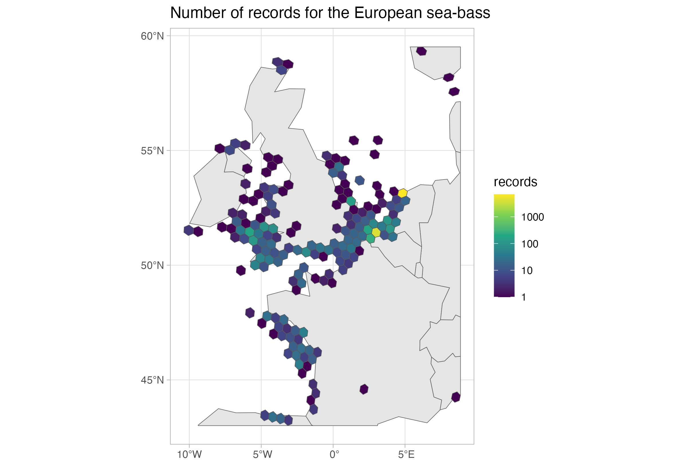
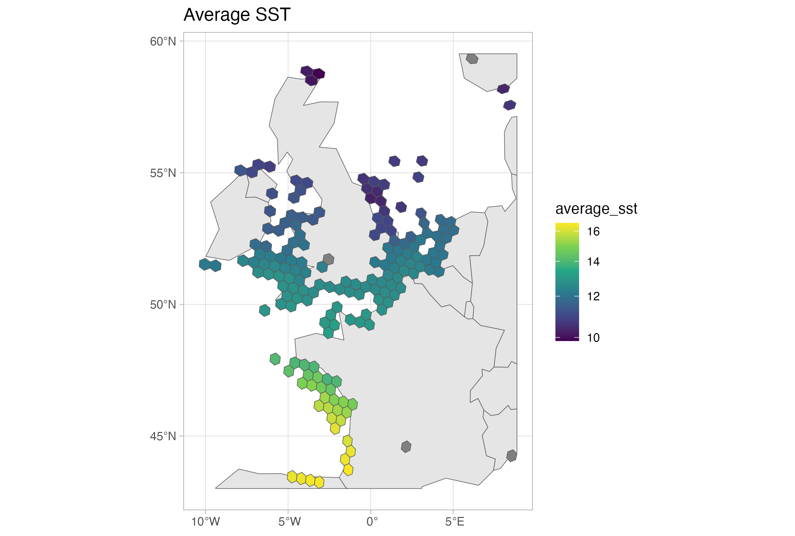

# `duckplyr`

In the two previous tutorials we learned about how to use [DuckDB for querying the Parquet exports]() and about [the DuckDB spatial extension](). Here we will explore the R package [`duckplyr`](https://duckplyr.tidyverse.org/index.html), a drop-in replacement for DuckDB on R which uses the `tidyverse` grammar.

Again, we will work with a local copy of the full export, which you can download from here: https://obis.org/data/access/. You can also explore together through the Jupyter Notebook ([download it locally](https://github.com/iobis/resources/blob/main/content/tutorials/duckdb-part3/duckdb-part3.ipynb) or open it through **Google Colab** by [clicking here](https://colab.research.google.com/github/iobis/resources/blob/main/content/tutorials/duckdb-part3/duckdb-part3.ipynb)).

We will work with the European sea-bass [*Dicentrarchus labrax*](https://obis.org/taxon/126975). Let's start by simpling get all records for it.

``` r
suppressPackageStartupMessages(library(duckplyr)) # For queries
suppressPackageStartupMessages(library(tictoc)) # To get timings
suppressPackageStartupMessages(library(sf)) # To later work with the spatial results
suppressPackageStartupMessages(library(ggplot2)) # For plotting

# Put here the path to your downloaded full export
# In this case we need to add *.parquet
fe_path <- "/Volumes/OBIS2/obis_20250318_parquet/occurrence/*.parquet"

full_export <- read_parquet_duckdb(fe_path)

head(full_export)
```

    # A duckplyr data frame: 283 variables
      dataset_id    id    acceptedNameUsage acceptedNameUsageID accessRights aphiaid
      <chr>         <chr> <chr>             <chr>               <chr>          <dbl>
    1 00017595-e01… e3aa… <NA>              <NA>                http://crea…  126436
    2 00017595-e01… c0c1… <NA>              <NA>                http://crea…  126436
    3 00017595-e01… 0122… <NA>              <NA>                http://crea…  126436
    4 00017595-e01… 57bd… <NA>              <NA>                http://crea…  126436
    5 00017595-e01… 98ab… <NA>              <NA>                http://crea…  126436
    6 00017595-e01… b142… <NA>              <NA>                http://crea…  126436
    # ℹ 277 more variables: areas <list>, associatedMedia <chr>,
    #   associatedOccurrences <chr>, associatedOrganisms <chr>,
    #   associatedReferences <chr>, associatedSequences <chr>,
    #   associatedTaxa <chr>, basisOfRecord <chr>, bathymetry <dbl>, bed <chr>,
    #   behavior <chr>, bibliographicCitation <chr>, brackish <lgl>, caste <chr>,
    #   catalogNumber <chr>, class <chr>, classid <dbl>, collectionCode <chr>,
    #   collectionID <chr>, continent <chr>, coordinatePrecision <chr>, …

Note that differently from our previous tutorials, in this case `duckplyr` provides you with an overview (a sample) of the dataset once you open it. So far, we have not done any query. Let's proceed.

``` r
species_id <- 126975

seabass_rec <- full_export |>
    select(aphiaid, occurrenceID) |>
    filter(aphiaid == species_id) |>
    collect()

head(seabass_rec)
```

    # A tibble: 6 × 2
      aphiaid occurrenceID       
        <dbl> <chr>              
    1  126975 Trieste_1902_126975
    2  126975 Trieste_1903_126975
    3  126975 Trieste_1904_126975
    4  126975 Trieste_1905_126975
    5  126975 Trieste_1906_126975
    6  126975 Trieste_1907_126975

``` r
nrow(seabass_rec)
```

    [1] 14631

We quickly got all records for the species. Under the hood, `duckplyr` is doing a SQL call just as we did on previous tutorials. You can check the query in two ways - using `explain()` or `show_query()`

``` r
full_export |>
    select(aphiaid, occurrenceID) |>
    filter(aphiaid == species_id) |>
    explain()
```

    ┌───────────────────────────┐
    │       READ_PARQUET        │
    │    ────────────────────   │
    │         Function:         │
    │        READ_PARQUET       │
    │                           │
    │        Projections:       │
    │          aphiaid          │
    │        occurrenceID       │
    │                           │
    │          Filters:         │
    │ "r_base::=="(CAST(aphiaid │
    │    AS DOUBLE), 126975.0)  │
    │                           │
    │        ~277012 Rows       │
    └───────────────────────────┘

``` r
full_export |>
    # To use show_query, we first need to convert to tbl, the format used
    # by the package dbplyr
    as_tbl() |>
    select(aphiaid, occurrenceID) |>
    filter(aphiaid == species_id) |>
    show_query()
```

    <SQL>
    SELECT aphiaid, occurrenceID
    FROM as_tbl_duckplyr_CvATbPmIAU
    WHERE (aphiaid = 126975.0)

By checking the queries you might notice that *sometimes* the queries are overly complex. But even with that, the package make it easier to do the queries, since it uses a grammar that is well know by R users.

Now, we will do a more complex query. Aggregate by year, and get the number of records.

``` r
seabass_rec_year <- full_export |>
    select(aphiaid, occurrenceID, date_year, sst) |>
    filter(aphiaid == species_id) |>
    filter(!is.na(date_year)) |>
    group_by(date_year) |>
    summarise(
        records = n()
    ) |>
    collect()

tail(seabass_rec_year, 3)
```

    # A tibble: 3 × 2
      date_year records
          <dbl>   <int>
    1      2021     632
    2      2022     221
    3      2023     213

Now, and about the extensions? You can use them as usual! For example, to install the `httpfs` extension to work with online data you simply use `db_exec("INSTALL httpfs; LOAD httpfs;")`. Now we will try to use the spatial extension, that we saw on the last tutorial:

``` r
# Install the extension
db_exec("INSTALL spatial; LOAD spatial;")

sel_area <- "POLYGON ((-14.414063 43.325178, 9.140625 43.325178, 9.140625 60.06484, -14.414063 60.06484, -14.414063 43.325178))"
```

``` r
seabass_rec_geom <- full_export |>
    select(aphiaid, occurrenceID, date_year, sst, geometry) |>
    filter(aphiaid == species_id) |>
    filter(!is.na(date_year)) |>
    filter(ST_Intersects(geometry, ST_GeomFromText(sel_area))) |>
    collect()
```

``` r
# Error in `filter()`: 
# ℹ In argument: `ST_Intersects(geometry, ST_GeomFromText(sel_area))`.
# Caused by error in `ST_Intersects()`:
# ! could not find function "ST_Intersects"
# Run `rlang::last_trace()` to see where the error occurred.
```

As you see it fails. That is because `ST_Intersects` is not an R function, but a DuckDB extension function. How can we deal with that? We have to use the `dbplyr` capabilities instead. If you convert to a `tbl` object, you can then pass arbitrary functions to it. If it is not found in R, it will assume it is a DuckDB function.

``` r
seabass_rec_geom <- full_export |>
    # convert to tbl, the format used by the package dbplyr
    as_tbl() |>
    # Do the queries
    select(aphiaid, occurrenceID, date_year, sst, geometry) |>
    filter(aphiaid == species_id) |>
    filter(!is.na(date_year)) |>
    # It will assume it is a DuckDB function
    filter(ST_Intersects(geometry, ST_GeomFromText(sel_area))) |>
    #show_query() # If you want to check the query
    as_duckdb_tibble() |> # Go back to duckplyr, in this case not necessary as
                          # we are not doing further queries
    collect() # Materialize call

head(seabass_rec_geom, 3)
```

    # A tibble: 3 × 5
      aphiaid occurrenceID                        date_year   sst geometry  
        <dbl> <chr>                                   <dbl> <dbl> <list>    
    1  126975 IMR2017314-20801-126975                  2017  10.4 <raw [32]>
    2  126975 IMR9536-20181-56015-126975               2018  NA   <raw [32]>
    3  126975 ft115bis_bottom_5:MiFish_UE-asv0687      2022  12.5 <raw [32]>

One other nice extension is the H3 extension, which introduces the [H3 grid system](https://duckdb.org/community_extensions/extensions/h3.html) to DuckDB. Let's try it. We will do the same query as above, but now also get the H3 cells from it at the resolution 4, and plot the average SST and number of records in each heaxagon.

``` r
db_exec("INSTALL h3 FROM community; LOAD h3;")

seabass_rec_h3 <- full_export |>
    # convert to tbl, the format used by the package dbplyr
    as_tbl() |>
    # Do the queries
    select(aphiaid, occurrenceID, date_year, sst, geometry, decimalLongitude, decimalLatitude) |>
    filter(aphiaid == species_id) |>
    filter(!is.na(date_year)) |>
    # It will assume it is a DuckDB function
    filter(ST_Intersects(geometry, ST_GeomFromText(sel_area))) |>
    # Note that the resolution should be passed as an integer, that is why we add the L to 4
    mutate(h3_cell = h3_latlng_to_cell_string(decimalLatitude, decimalLongitude, 4L)) |>
    mutate(h3_pol = h3_cell_to_boundary_wkt(h3_cell)) |>
    #show_query() # If you want to check the query
    as_duckdb_tibble() |> # Go back to duckplyr
    group_by(h3_cell, h3_pol) |>
    summarise(
        records = n(),
        average_sst = mean(sst, na.rm = T)
    ) |>
    collect() # Materialize call

head(seabass_rec_h3, 3)
```

    # A tibble: 3 × 4
    # Groups:   h3_cell [3]
      h3_cell         h3_pol                                     records average_sst
      <chr>           <chr>                                        <int>       <dbl>
    1 840983dffffffff POLYGON ((6.234412 59.515652, 5.864064 59…       1       NaN  
    2 8409933ffffffff POLYGON ((8.124682 57.683255, 8.027435 57…       1        10.6
    3 84099e9ffffffff POLYGON ((7.739213 58.299457, 7.642413 58…       1        10.4

We can now plot it:

``` r
seabass_rec_h3_sf <- st_as_sf(
    seabass_rec_h3, wkt = "h3_pol", crs = 4326
)

sf_use_s2(FALSE)
wrld <- rnaturalearth::ne_countries(returnclass = "sf")
wrld <- st_crop(wrld, seabass_rec_h3_sf)

ggplot() +
    geom_sf(data = wrld, fill = "grey90") +
    geom_sf(data = seabass_rec_h3_sf, aes(fill = records)) +
    scale_fill_viridis_c(transform = "log10") +
    theme_light() +
    ggtitle("Number of records for the European sea-bass")
```


``` r
ggplot() +
    geom_sf(data = wrld, fill = "grey90") +
    geom_sf(data = seabass_rec_h3_sf, aes(fill = average_sst)) +
    scale_fill_viridis_c(transform = "log10") +
    theme_light() +
    ggtitle("Average SST")
```






And that concludes our series about the use of DuckDB for querying the OBIS Parquet exports. We hope this will give you more tools to work with OBIS data.
