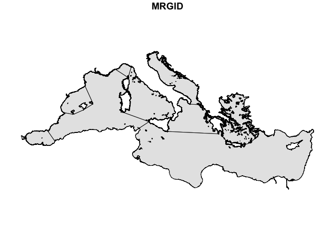
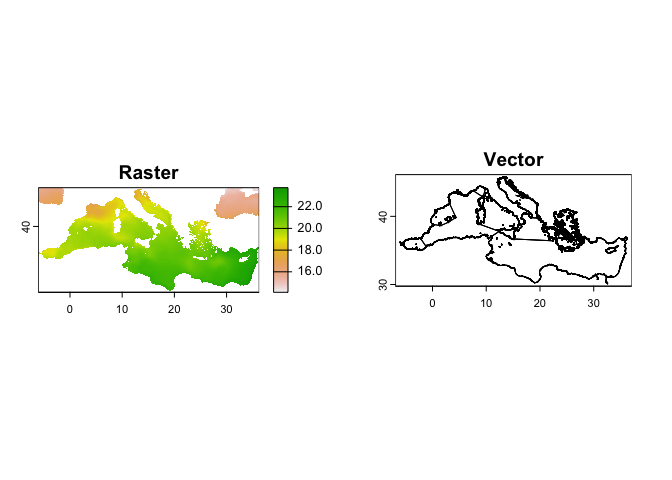
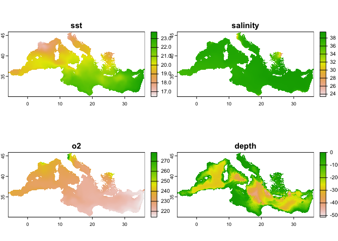
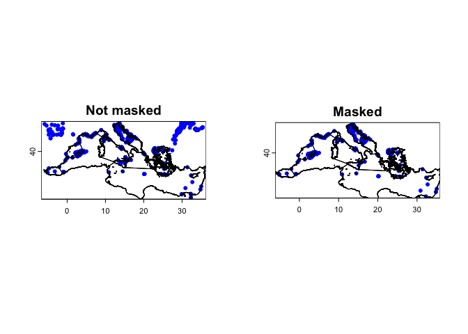
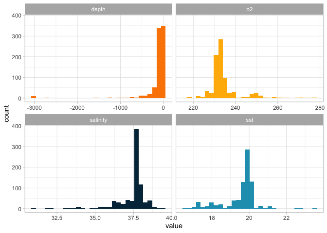
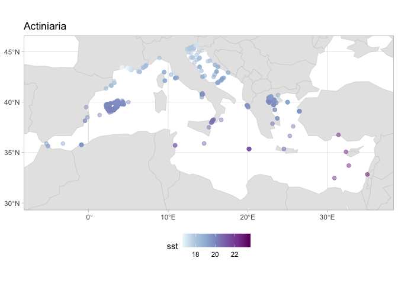

# Obtaining environmental information for species occurrences

For many research questions, we are interested in the environmental
conditions where a certain species, population, or community lives. OBIS
already provides some environmental data along with the records. For
example, if you download records for the species *Actinia equina*, you
can obtain values for sea surface temperature (SST), salinity (SSS), and
bathymetry:

    library(robis)

    occ <- occurrence("Actinia equina")

    ## Retrieved 5000 records of approximately 9583 (52%)Retrieved 9583 records of
    ## approximately 9583 (100%)

    head(occ[,c("sst", "sss", "bathymetry")], 4)

    ## # A tibble: 4 × 3
    ##     sst   sss bathymetry
    ##   <dbl> <dbl>      <dbl>
    ## 1  10.6  35.2        -50
    ## 2  10.6  34.8        -49
    ## 3  NA    NA           -7
    ## 4  11.4  34.2         -4

However, there are many other variables of interest. Also, depending on
your question, you may need another source of environmental information
or a different resolution. Here we will explore how to extract
environmental information for these occurrences. This tutorial will
explore extracting data from [**Bio-ORACLE**](Bio-Oracle), which
provides essential physical, chemical, biological, and topographic data
layers with global extent and uniform resolution. You can use the same
code to extract data from any other data source in raster format.

## Download data from Bio-ORACLE

The new version of Bio-ORACLE (v3) is hosted in an ERDDAP server, which
enable us to download only the data for the region and time period we
need. We can use the package [`biooracler` to download the
layers](https://github.com/bio-oracle/biooracler). First install the
package. We also load the `terra` package, for spatial operations (see
explanation on the next section).

    # install.packages("devtools")
    devtools::install_github("bio-oracle/biooracler")

    library(biooracler)
    library(terra)

    ## terra 1.7.71

    ## 
    ## Attaching package: 'terra'

    ## The following object is masked from 'package:robis':
    ## 
    ##     area

For our exercise we will obtain the data for species occurring in the
Mediterranean sea. Thus, we can download the data for only this region.
We download a shapefile of this area using the Marine Regions.

    # Install the package
    install.packages("mregions2", repos = "https://ropensci.r-universe.dev")
    install.packages("wrapr")

    library(mregions2)

    ## Warning: package 'mregions2' was built under R version 4.3.3

    library(sf)

    ## Linking to GEOS 3.11.0, GDAL 3.5.3, PROJ 9.1.0; sf_use_s2() is TRUE

    med <- gaz_search(1905) %>%
      gaz_geometry()

    plot(med, max.plot = 1, col = "grey90")

From the shapefile, we can see which are the limits (longitude and
latitude) for this area:

    limits <- st_bbox(med)
    limits

    ##      xmin      ymin      xmax      ymax 
    ## -6.032549 30.068087 36.215729 45.808914

With this information we can then download the data. We will obtain 4
parameters: SST, salinity, bathymetry and oxygen. You can see the
dataset IDs using the function `list_layers`

    head(list_layers()[,1:2])

    ## Registered S3 method overwritten by 'hoardr':
    ##   method           from
    ##   print.cache_info httr

    ## # A tibble: 6 × 2
    ##   dataset_id                       title                                        
    ##   <chr>                            <chr>                                        
    ## 1 tas_baseline_2000_2020_depthsurf Bio-Oracle AirTemperature [depthSurf] Baseli…
    ## 2 tas_ssp119_2020_2100_depthsurf   Bio-Oracle AirTemperature [depthSurf] SSP119…
    ## 3 tas_ssp126_2020_2100_depthsurf   Bio-Oracle AirTemperature [depthSurf] SSP126…
    ## 4 tas_ssp245_2020_2100_depthsurf   Bio-Oracle AirTemperature [depthSurf] SSP245…
    ## 5 tas_ssp370_2020_2100_depthsurf   Bio-Oracle AirTemperature [depthSurf] SSP370…
    ## 6 tas_ssp460_2020_2100_depthsurf   Bio-Oracle AirTemperature [depthSurf] SSP460…

    dataset_ids <- c("thetao_baseline_2000_2019_depthsurf",
                    "so_baseline_2000_2019_depthsurf",
                    "o2_baseline_2000_2018_depthsurf")

    time = c('2010-01-01T00:00:00Z', '2010-01-01T00:00:00Z')
    latitude = limits[c(2,4)]
    longitude = limits[c(1,3)]

    constraints = list(time, latitude, longitude)
    names(constraints) = c("time", "latitude", "longitude")

    # We also need to define which variables are needed from each one. 
    # In this case we will download the mean for all
    # You can see the variables by using info_layer:
    info_layer(dataset_ids[1])

    ## <ERDDAP info> thetao_baseline_2000_2019_depthsurf 
    ##  Base URL: http://erddap.bio-oracle.org/erddap 
    ##  Dataset Type: griddap 
    ##  Dimensions (range):  
    ##      time: (2000-01-01T00:00:00Z, 2010-01-01T00:00:00Z) 
    ##      latitude: (-89.975, 89.975) 
    ##      longitude: (-179.975, 179.975) 
    ##  Variables:  
    ##      thetao_ltmax: 
    ##          Units: degree_C 
    ##      thetao_ltmin: 
    ##          Units: degree_C 
    ##      thetao_max: 
    ##          Units: degree_C 
    ##      thetao_mean: 
    ##          Units: degree_C 
    ##      thetao_min: 
    ##          Units: degree_C 
    ##      thetao_range: 
    ##          Units: degree_C

    variables <- c("thetao_mean", "so_mean", "o2_mean")

    # To download, we need to pass the ids and variables to the function, one each time
    # You can do that using a for loop or mapply:
    download_data <- function(id, variable) {
      download_layers(id, variable, constraints, directory = ".")
    }

    env_layers <- mapply(download_data, dataset_ids, variables)

    ## Selected dataset thetao_baseline_2000_2019_depthsurf.

    ## Dataset info available at: http://erddap.bio-oracle.org/erddap/griddap/thetao_baseline_2000_2019_depthsurf.html

    ## Selected 1 variables: thetao_mean

    ## Selected dataset so_baseline_2000_2019_depthsurf.

    ## Dataset info available at: http://erddap.bio-oracle.org/erddap/griddap/so_baseline_2000_2019_depthsurf.html

    ## Selected 1 variables: so_mean

    ## Selected dataset o2_baseline_2000_2018_depthsurf.

    ## Dataset info available at: http://erddap.bio-oracle.org/erddap/griddap/o2_baseline_2000_2018_depthsurf.html

    ## Selected 1 variables: o2_mean

    # We can easily convert the list of SpatRasters into a multilayer SpatRaster using `rast`
    env_layers <- rast(env_layers)
    env_layers

    ## class       : SpatRaster 
    ## dimensions  : 316, 846, 3  (nrow, ncol, nlyr)
    ## resolution  : 0.05, 0.05  (x, y)
    ## extent      : -6.05, 36.25, 30.05, 45.85  (xmin, xmax, ymin, ymax)
    ## coord. ref. : lon/lat WGS 84 
    ## sources     : 605fc9b38decbff0cc9dbf7466ce9763.nc  
    ##               0e41eda3a088ee25b29d4cf81ce5dd28.nc  
    ##               a43ce5ec09281f9f807682ee717c2f5d.nc  
    ## varnames    : thetao_mean (Average OceanTemperature) 
    ##               so_mean (Average Salinity) 
    ##               o2_mean (Average DissolvedMolecularOxygen) 
    ## names       : thetao_bas~_depthsurf, so_baselin~_depthsurf, o2_baselin~_depthsurf 
    ## unit        :              degree_C,                   PSU,            MMol' 'M-3 
    ## time        : 2010-01-01 UTC

For bathymetry we need to supply a different time:

    constraints$time <- c("1970-01-01T00:00:00Z", "1970-01-01T00:00:00Z")

    bath <- download_layers("terrain_characteristics",
                            "bathymetry_mean",
                            constraints, directory = ".")

    ## Selected dataset terrain_characteristics.

    ## Dataset info available at: http://erddap.bio-oracle.org/erddap/griddap/terrain_characteristics.html

    ## Selected 1 variables: bathymetry_mean

    bath

    ## class       : SpatRaster 
    ## dimensions  : 316, 846, 1  (nrow, ncol, nlyr)
    ## resolution  : 0.05, 0.05  (x, y)
    ## extent      : -6.05, 36.25, 30.05, 45.85  (xmin, xmax, ymin, ymax)
    ## coord. ref. : lon/lat WGS 84 
    ## source      : 9e5d27b9659e2585cd3050d884cf5151.nc 
    ## varname     : bathymetry_mean (Bathymetry Mean) 
    ## name        : bathymetry_mean 
    ## unit        :               m 
    ## time        : 1970-01-01 UTC

## The `terra` package

For processing the raster files we will use the [`terra`
package](https://rspatial.github.io/terra/). This package enable spatial
operations on both rasters and vectors (shapefiles). Other packages
exist for raster operations
(e.g. [`stars`](https://r-spatial.github.io/stars/)), but for many of
the main operations `terra` provides a simple syntax and is very fast.
To learn how to use `terra`, a good resource is this website:
[rspatial.org/terra](https://rspatial.org/index.html)

Here we will use both **rasters** and **vectors**. In geospatial data,
rasters represent data as a grid of cells or pixels, each with a
specific value, suitable for continuous data like temperature or
elevation. Rasters can have multiple layers, as the one we loaded as
`env_layers`. Vectors represent data as points, lines, or polygons. In
our case, we have a vector for the boundaries of the Mediterranean which
we loaded using `sf`. We can convert to the terra format, `SpatVector`
using `vect`:

    med <- vect(med)

    par(mfrow = c(1,2))
    plot(env_layers[[1]], main = "Raster")
    plot(med, main = "Vector")

We will mask our raster, to ensure that we only have the data for the
areas of the Mediterranean. To make easier to extract the data all at
once, we will join the bathymetry layer with the others:

    all_layers <- c(env_layers, bath)

    all_layers <- terra::mask(all_layers, med)

    # Change names for easier handling
    names(all_layers) <- c("sst", "salinity", "o2", "depth")
    plot(all_layers, main = names(all_layers))

TIP: Note that for `mask` we used the package prefix
(i.e. `terra::mask()`). Some names such as **mask** or **extract** are
also used by other packages, namely those from `tidyverse`. Using the
prefix avoid that the wrong function is used.

## Extracting data

Let’s download some data from OBIS now. We will get data for all species
in the order Actiniaria within that region:

    target_area <- st_as_text(st_as_sfc(st_bbox(env_layers[[1]])))

    actiniaria <- occurrence("Actiniaria", geometry = target_area,
                             # Limit to some fields that we need here
                             fields = c("taxonID", "scientificName", "decimalLongitude", "decimalLatitude", "speciesid"))

    ## Retrieved 2289 records of approximately 2289 (100%)

    # Filter for only those at species level
    actiniaria <- actiniaria[!is.na(actiniaria$speciesid), ]

For extraction operations with `terra` you can work with `data.frames`.
But we will convert it to a `SpatVector` to use some other interesting
functions. For example, we can mask our points according to the
Mediterranean borders.

    actiniaria_vec <- vect(actiniaria, geom = c("decimalLongitude", "decimalLatitude"), crs = "EPSG:4326")

    actiniaria_vec_filt <- terra::mask(actiniaria_vec, med)

    par(mfrow = c(1,2))
    plot(actiniaria_vec, pch = 20, cex = 1, col = "blue", main = "Not masked");lines(med)
    plot(actiniaria_vec_filt, pch = 20, cex = 1, col = "blue", main = "Masked");lines(med)

Now we are ready to extract the data. This is very simple:

    extracted_data <- terra::extract(all_layers, actiniaria_vec_filt, ID = FALSE)

    head(extracted_data)

    ##        sst salinity       o2       depth
    ## 1 19.87718 37.68975 232.8744   -82.69444
    ## 2 20.48257 38.04504 225.7063 -1223.72217
    ## 3 19.97063 37.62606 232.0623  -159.08333
    ## 4 19.63475 37.98786 235.2972   -39.00000
    ## 5 19.51212 36.99345 233.4251     0.00000
    ## 6 20.04503 37.58446 231.0133   -52.30556

As you can see, it extracted the environmental infromation for all
points. We can get a good summary with `summary`

    summary(extracted_data)

    ##       sst           salinity           o2            depth         
    ##  Min.   :16.66   Min.   :30.88   Min.   :216.9   Min.   :-3020.19  
    ##  1st Qu.:19.41   1st Qu.:37.47   1st Qu.:231.1   1st Qu.:  -87.08  
    ##  Median :19.83   Median :37.65   Median :232.6   Median :  -57.72  
    ##  Mean   :19.51   Mean   :37.43   Mean   :234.5   Mean   : -131.32  
    ##  3rd Qu.:20.00   3rd Qu.:37.83   3rd Qu.:235.3   3rd Qu.:  -29.36  
    ##  Max.   :23.61   Max.   :39.35   Max.   :278.3   Max.   :    0.00  
    ##  NA's   :135     NA's   :135     NA's   :135     NA's   :135

Note that we have 135 NA points, i.e. with no information. Those points
are probably on land. You may chose to remove those or you can find the
nearest valid point. In our case we will simply remove them.

    actiniaria_vec_filt <- cbind(actiniaria_vec_filt, extracted_data)

    actiniaria_vec_filt <- actiniaria_vec_filt[!is.na(actiniaria_vec_filt$sst),]

# Plotting this information

There are different ways to plot this information. A good way of having
an overview is by using a histogram. We will use `dplyr`, `tidyr` and
`ggplot2` for that.

    library(dplyr)

    ## 
    ## Attaching package: 'dplyr'

    ## The following objects are masked from 'package:terra':
    ## 
    ##     intersect, union

    ## The following objects are masked from 'package:stats':
    ## 
    ##     filter, lag

    ## The following objects are masked from 'package:base':
    ## 
    ##     intersect, setdiff, setequal, union

    library(tidyr)

    ## 
    ## Attaching package: 'tidyr'

    ## The following object is masked from 'package:terra':
    ## 
    ##     extract

    library(ggplot2)

    extracted_data <- as.data.frame(actiniaria_vec_filt) %>%
      select(sst, salinity, o2, depth)

    extracted_data_long <- pivot_longer(extracted_data, cols = 1:4, names_to = "variable", values_to = "value")

    head(extracted_data_long)

    ## # A tibble: 6 × 2
    ##   variable value
    ##   <chr>    <dbl>
    ## 1 sst       19.9
    ## 2 salinity  37.7
    ## 3 o2       233. 
    ## 4 depth    -82.7
    ## 5 sst       20.5
    ## 6 salinity  38.0

    ggplot(extracted_data_long) +
      geom_histogram(aes(value, fill = variable)) +
      scale_fill_manual(values = c("#fb8500", "#ffb703", "#023047", "#219ebc")) +
      theme_light() + theme(legend.position = "none") +
      facet_wrap(~ variable, scales = "free_x")

    ## `stat_bin()` using `bins = 30`. Pick better value with `binwidth`.

Another possible way is to display geographically. We can do that for
temperature for example:

    # We get a shapefile of the continents
    wrld <- rnaturalearth::ne_countries(returnclass = "sf")

    # Convert the data to sf format, as ggplot2 have nice features for sf
    actiniaria_vec_filt <- st_as_sf(actiniaria_vec_filt)

    ggplot() +
      geom_sf(data = wrld, color = "grey80", fill = "grey90") +
      geom_sf(data = actiniaria_vec_filt, aes(color = sst), size = 2, alpha = .5) +
      scale_color_distiller(palette = "BuPu", direction = 1) +
      coord_sf(xlim = limits[c(1,3)], ylim = limits[c(2,4)]) +
      ggtitle("Actiniaria") +
      theme_light() +
      theme(legend.position = "bottom")

In a next tutorial we will explore how to download environmental data
from other sources, like Copernicus or NOAA, what opens many
possibilities of research.
